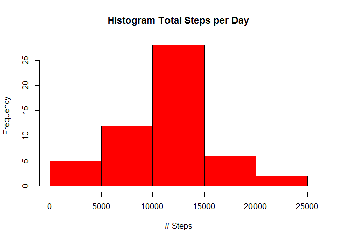
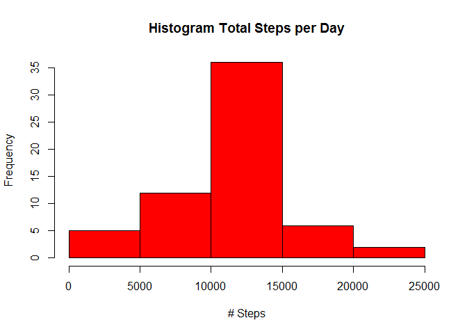
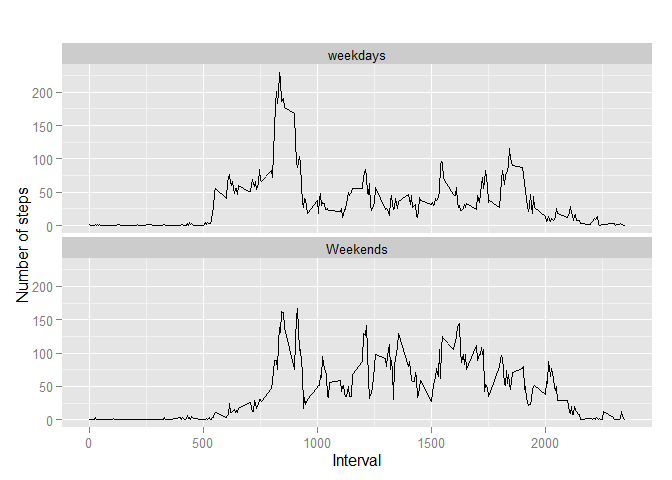

# Reproducible Research: Peer Assessment 1


## Loading and preprocessing the data

```r
activity_data=read.csv("activity.csv", header = T)
head(activity_data)
```

```
##   steps       date interval
## 1    NA 2012-10-01        0
## 2    NA 2012-10-01        5
## 3    NA 2012-10-01       10
## 4    NA 2012-10-01       15
## 5    NA 2012-10-01       20
## 6    NA 2012-10-01       25
```

```r
str(activity_data)
```

```
## 'data.frame':	17568 obs. of  3 variables:
##  $ steps   : int  NA NA NA NA NA NA NA NA NA NA ...
##  $ date    : Factor w/ 61 levels "2012-10-01","2012-10-02",..: 1 1 1 1 1 1 1 1 1 1 ...
##  $ interval: int  0 5 10 15 20 25 30 35 40 45 ...
```

```r
dim(activity_data)[1]
```

```
## [1] 17568
```

```r
# remove NA in data
data1 <- activity_data[ with (activity_data, { !(is.na(steps)) } ), ]
head(data1)
```

```
##     steps       date interval
## 289     0 2012-10-02        0
## 290     0 2012-10-02        5
## 291     0 2012-10-02       10
## 292     0 2012-10-02       15
## 293     0 2012-10-02       20
## 294     0 2012-10-02       25
```

```r
str(data1)
```

```
## 'data.frame':	15264 obs. of  3 variables:
##  $ steps   : int  0 0 0 0 0 0 0 0 0 0 ...
##  $ date    : Factor w/ 61 levels "2012-10-01","2012-10-02",..: 2 2 2 2 2 2 2 2 2 2 ...
##  $ interval: int  0 5 10 15 20 25 30 35 40 45 ...
```

```r
table(data1$interval)
```

```
## 
##    0    5   10   15   20   25   30   35   40   45   50   55  100  105  110 
##   53   53   53   53   53   53   53   53   53   53   53   53   53   53   53 
##  115  120  125  130  135  140  145  150  155  200  205  210  215  220  225 
##   53   53   53   53   53   53   53   53   53   53   53   53   53   53   53 
##  230  235  240  245  250  255  300  305  310  315  320  325  330  335  340 
##   53   53   53   53   53   53   53   53   53   53   53   53   53   53   53 
##  345  350  355  400  405  410  415  420  425  430  435  440  445  450  455 
##   53   53   53   53   53   53   53   53   53   53   53   53   53   53   53 
##  500  505  510  515  520  525  530  535  540  545  550  555  600  605  610 
##   53   53   53   53   53   53   53   53   53   53   53   53   53   53   53 
##  615  620  625  630  635  640  645  650  655  700  705  710  715  720  725 
##   53   53   53   53   53   53   53   53   53   53   53   53   53   53   53 
##  730  735  740  745  750  755  800  805  810  815  820  825  830  835  840 
##   53   53   53   53   53   53   53   53   53   53   53   53   53   53   53 
##  845  850  855  900  905  910  915  920  925  930  935  940  945  950  955 
##   53   53   53   53   53   53   53   53   53   53   53   53   53   53   53 
## 1000 1005 1010 1015 1020 1025 1030 1035 1040 1045 1050 1055 1100 1105 1110 
##   53   53   53   53   53   53   53   53   53   53   53   53   53   53   53 
## 1115 1120 1125 1130 1135 1140 1145 1150 1155 1200 1205 1210 1215 1220 1225 
##   53   53   53   53   53   53   53   53   53   53   53   53   53   53   53 
## 1230 1235 1240 1245 1250 1255 1300 1305 1310 1315 1320 1325 1330 1335 1340 
##   53   53   53   53   53   53   53   53   53   53   53   53   53   53   53 
## 1345 1350 1355 1400 1405 1410 1415 1420 1425 1430 1435 1440 1445 1450 1455 
##   53   53   53   53   53   53   53   53   53   53   53   53   53   53   53 
## 1500 1505 1510 1515 1520 1525 1530 1535 1540 1545 1550 1555 1600 1605 1610 
##   53   53   53   53   53   53   53   53   53   53   53   53   53   53   53 
## 1615 1620 1625 1630 1635 1640 1645 1650 1655 1700 1705 1710 1715 1720 1725 
##   53   53   53   53   53   53   53   53   53   53   53   53   53   53   53 
## 1730 1735 1740 1745 1750 1755 1800 1805 1810 1815 1820 1825 1830 1835 1840 
##   53   53   53   53   53   53   53   53   53   53   53   53   53   53   53 
## 1845 1850 1855 1900 1905 1910 1915 1920 1925 1930 1935 1940 1945 1950 1955 
##   53   53   53   53   53   53   53   53   53   53   53   53   53   53   53 
## 2000 2005 2010 2015 2020 2025 2030 2035 2040 2045 2050 2055 2100 2105 2110 
##   53   53   53   53   53   53   53   53   53   53   53   53   53   53   53 
## 2115 2120 2125 2130 2135 2140 2145 2150 2155 2200 2205 2210 2215 2220 2225 
##   53   53   53   53   53   53   53   53   53   53   53   53   53   53   53 
## 2230 2235 2240 2245 2250 2255 2300 2305 2310 2315 2320 2325 2330 2335 2340 
##   53   53   53   53   53   53   53   53   53   53   53   53   53   53   53 
## 2345 2350 2355 
##   53   53   53
```


## What is mean total number of steps taken per day?

```r
#Calculate the total number of steps taken per day
library(dplyr)
```

```
## 
## Attaching package: 'dplyr'
## 
## The following object is masked from 'package:stats':
## 
##     filter
## 
## The following objects are masked from 'package:base':
## 
##     intersect, setdiff, setequal, union
```

```r
by_date<- group_by(data1, date)
total_number<- summarise(by_date,total_step = sum(steps))


## histogram of of total step by date
hist(total_number$total_step, main="Histogram Total Steps per Day", xlab="# Steps", col="red") # plot a histogram  
```

 

```r
##Calculate and report the mean and median of the total number of steps taken per day
summary(total_number$total_step)
```

```
##    Min. 1st Qu.  Median    Mean 3rd Qu.    Max. 
##      41    8841   10760   10770   13290   21190
```


## What is the average daily activity pattern?

```r
# preprocessing data for plot
steps_by_interval <- aggregate(steps ~ interval, data1, mean)

# create a time series plot 
plot(steps_by_interval$interval, steps_by_interval$steps, type='l', 
     main="Average number of steps over all days", xlab="Interval", 
     ylab="Average number of steps")
```

 

```r
###finding the maximum interval
#which.max indicate for us the position. 
steps_by_interval[which.max(steps_by_interval$steps),]
```

```
##     interval    steps
## 104      835 206.1698
```


## Imputing missing values

```r
#Calculate and report the total number of missing values in the dataset (i.e. the total number of rows with NAs)
table(is.na(activity_data$steps))
```

```
## 
## FALSE  TRUE 
## 15264  2304
```

```r
#imputing all those NA step row in the orignal data with the mean steps from each 5 mins intevral timing. 
new_data=activity_data

for (i in 1: dim(new_data)[1]){
  if(is.na(new_data$steps[i])){
    interval_vaue=new_data$interval[i]
    new_data$newsteps[i]=steps_by_interval$steps[steps_by_interval$interval==interval_vaue]
  } else new_data$newsteps[i]=new_data$steps[i]
}

#checking the impute data
head(new_data[is.na(new_data$steps),])
```

```
##   steps       date interval  newsteps
## 1    NA 2012-10-01        0 1.7169811
## 2    NA 2012-10-01        5 0.3396226
## 3    NA 2012-10-01       10 0.1320755
## 4    NA 2012-10-01       15 0.1509434
## 5    NA 2012-10-01       20 0.0754717
## 6    NA 2012-10-01       25 2.0943396
```

```r
#histogram for the new_data
by_date_new<- group_by(new_data, date)
total_numbe_newr<- summarise(by_date_new,total_step_new = sum(newsteps))


## histogram of of total step by date
hist(total_numbe_newr$total_step_new, main="Histogram Total Steps per Day", xlab="# Steps", col="red") # plot a histogram  
```

 

```r
##Calculate and report the new_mean and new_ median of the total number of steps taken per day
summary(total_numbe_newr$total_step_new)[3]
```

```
## Median 
##  10770
```

```r
#comparing the 2 mean and median

mean1_vs_mean2=c(summary(total_number$total_step)[4],summary(total_numbe_newr$total_step_new)[4])
median1_vs_median2=c(summary(total_number$total_step)[3],summary(total_numbe_newr$total_step_new)[3])
```


## Are there differences in activity patterns between weekdays and weekends?

#creating a new factor for the new dataset.
new_data$new_weekday=weekdays(new_data$date)
head(new_data)

#as weekdays function only allow monday to sunday, we need to categeroise them into 2
new_data$new_type=ifelse(((new_data$new_weekday=="Sunday")|(new_data$new_weekday=="Saturday")),"Weekends","weekdays")
head(new_data)

#exporting the data
write.table(new_data, "~/GitHub/RepData_PeerAssessment1/mydata.txt", sep="\t")

```r
head(new_data)
```

```
##   steps       date interval  newsteps
## 1    NA 2012-10-01        0 1.7169811
## 2    NA 2012-10-01        5 0.3396226
## 3    NA 2012-10-01       10 0.1320755
## 4    NA 2012-10-01       15 0.1509434
## 5    NA 2012-10-01       20 0.0754717
## 6    NA 2012-10-01       25 2.0943396
```

```r
new_data1=read.table("mydata.txt", , sep="\t")

steps_by_interval_1=aggregate(newsteps~interval+new_type,new_data1,mean)
library(ggplot2)
```

```
## Warning: package 'ggplot2' was built under R version 3.1.3
```

```r
# creat a plot
qplot(interval, 
      newsteps, 
      data = steps_by_interval_1, 
      type = 'l', 
      geom=c("line"),
      xlab = "Interval", 
      ylab = "Number of steps", 
      main = "") +
  facet_wrap(~ new_type, ncol = 1)
```

 
